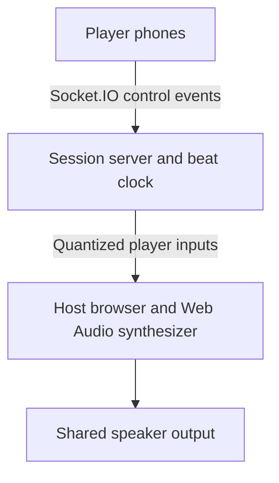

  

# BandLive

**Hackathon project for real time collaborative music in the browser.**

BandLive lets a host create a session on a laptop while players join from their phones and perform together using simple instrument pads. Control signals travel over the network while the host synthesizes the shared audio locally.

## Demo Walkthrough

1. Open the host dashboard and create a session.
2. Share the generated code or QR link with nearby players.
3. Join from phone browsers without installing an application.
4. Choose drums, bass, melody, or effects and tap the performance pads.
5. Let the server quantize inputs to the beat while the host mixes the audio.
6. Adjust tempo and transport controls from the host dashboard.

## Architecture

## Technical Approach

- React and TypeScript browser interfaces
- Express, tRPC, and Socket.IO server
- Server authoritative session state and beat timing
- Web Audio API synthesis without streaming audio files
- Pentatonic note constraints to keep player combinations harmonious

## Public Repository

| Repository | Purpose |
| --- | --- |
| [band-app-v2](https://github.com/cornelljam/band-app-v2) | Browser prototype, real time event protocol, audio engine, and local setup guidance |

## Note

Performance depends on network conditions, device timing, and the deployment environment.

[View the BandLive source](https://github.com/cornelljam/band-app-v2)
